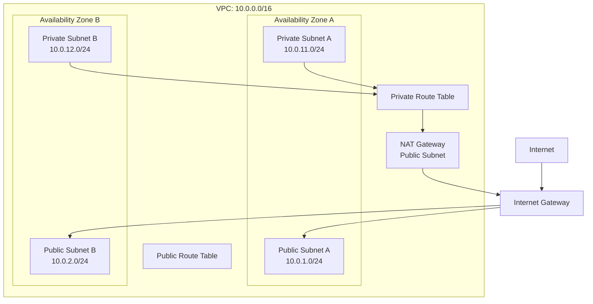

# Week 01 — AWS Networking Fundamentals

## 1. Sơ đồ kiến trúc VPC

## 2. Network Isolation

### Vì sao Application Server và Database đặt ở Private Subnet?

- Application Server và Database được đặt trong Private Subnet để không nhận kết nối trực tiếp từ Internet. Public Subnet chỉ dành cho các thành phần cần tiếp nhận traffic công khai, ví dụ Application Load Balancer hoặc NAT Gateway.

- Database chỉ cho phép Application Server truy cập qua port cần thiết, ví dụ PostgreSQL port 5432. Việc này giảm bề mặt tấn công, bảo vệ dữ liệu và tuân theo nguyên tắc least privilege.

-> Private Subnet vẫn có thể truy cập Internet để tải bản vá hoặc dependency qua NAT Gateway, nhưng Internet không thể tự khởi tạo kết nối tới các resource trong subnet này.

## 3. Security Group và Network ACL

| Tiêu chí | Security Group | Network ACL |
|---       |---             |---          |
| Phạm vi    | Resource/Instance | Subnet |
| Trạng thái | Stateful | Stateless |
| Rule       | Chỉ Allow | Allow và Deny |
| Return traffic | Tự động cho phép | Phải cho phép rõ ở cả hai chiều |
| Cách xét rule | Tổng hợp rule Allow | Xét theo số thứ tự từ thấp đến cao |

### Ví dụ Stateful và Stateless

Security Group cho phép inbound HTTPS TCP port 443 từ Internet. Khi web server gửi response về client, response được tự động cho phép vì Security Group là Stateful.

Nếu sử dụng NACL, cần cho phép inbound TCP port 443 và đồng thời cho phép outbound traffic đến ephemeral ports của client. Nếu thiếu outbound rule cho traffic phản hồi, kết nối HTTPS có thể thất bại vì NACL là Stateless.

## 4. Tài liệu tham khảo

- [Amazon VPC](https://docs.aws.amazon.com/vpc/latest/userguide/what-is-amazon-vpc.html)
- [Internet Gateway](https://docs.aws.amazon.com/vpc/latest/userguide/VPC_Internet_Gateway.html)
- [Route tables](https://docs.aws.amazon.com/vpc/latest/userguide/subnet-route-tables.html)
- [Security Groups](https://docs.aws.amazon.com/vpc/latest/userguide/vpc-security-groups.html)
- [Network ACLs](https://docs.aws.amazon.com/vpc/latest/userguide/vpc-network-acls.html)